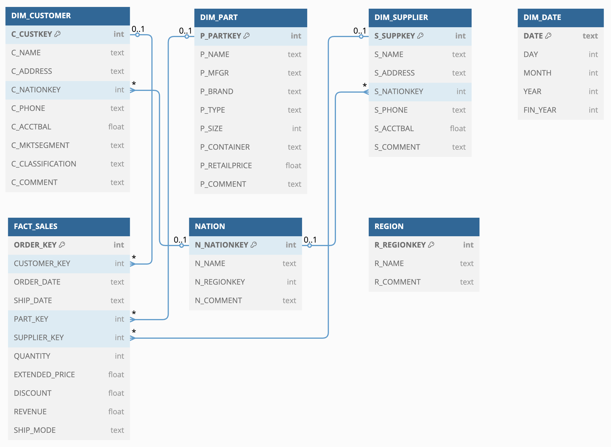

<div align="center"> 
    <h3> Beerwulf <code>Data Assessment</code> 💻 </h3>
</div>

#

> [!NOTE]
> This mini *ETL* project was done as an assessment for [`Beerwulf`](http://www.beerwulf.com/) for the position of [`Data Engineer (Medior)`](https://beerwulf.homerun.co/data-engineer-medior-2/en). 

<div align="center">

<table>
  <tr>
    <td><strong>CI</strong></td>
    <td>
      <a href="https://github.com/mohammadzainabbas/beerwulf-assessment/actions/workflows/ci.yml">
        
      </a>
    </td>
  </tr>
  <tr>
    <td><strong>Meta</strong></td>
    <td>
      <a href="https://github.com/astral-sh/uv">
        
      </a>
      <a href="https://github.com/astral-sh/ruff">
        
      </a>
      <a href="https://spdx.org/licenses/">
        
      </a>
    </td>
  </tr>
</table>

</div>

> [!IMPORTANT]
> This repository contains code for a simplified ETL process to load a provided dataset into a star schema.
>
> **Key points:**
>
> - [x] Designed a star schema with fact and dimension tables.
> - [x] ETL scripts to populate the schema.
> - [x] Added a customer account balance classification (`Low`, `Medium`, `High`) using `C_ACCTBAL` and computed revenue per line item. *(Extra points)*
> - [x] Dockerized environment and `uv` for reproducible Python management.
> - [x] Instructions for scheduling, streaming data handling, and production deployment are described below.

#

## Project Structure

- [**`etl/`**](https://github.com/mohammadzainabbas/beerwulf-assessment/tree/main/etl) – Contains modular ETL scripts for extraction, transformation (including customer classification and revenue calculation), and loading into a SQLite star schema.
- [**`sql/ddl_star.sql`**](https://github.com/mohammadzainabbas/beerwulf-assessment/blob/main/sql/ddl_star.sql) – DDL for creating the star schema.
- [**`sql/reporting.sql`**](https://github.com/mohammadzainabbas/beerwulf-assessment/blob/main/sql/reporting.sql) – Optimized SQL queries answering key business questions (see 5.a to 5.e in [REQUIREMENTS.md](https://github.com/mohammadzainabbas/beerwulf-assessment/blob/main/REQUIREMENTS.md)).
- [**`Dockerfile`**](https://github.com/mohammadzainabbas/beerwulf-assessment/blob/main/Dockerfile) – For reproducible environment to quickly start interacting with star schema with `sqlite3` shell.

#

## ETL Process Overview

- **Extraction:** Reads raw `.tbl` files (delimited by `|`) using `pandas`.
- **Transformation:** 
  - Creates dimension tables (`customer`, `part`, `supplier`, `date`) and fact table (`sales`).
  - Computes revenue per line item as `L_EXTENDEDPRICE * (1 - L_DISCOUNT)`.
  - Classifies customers based on `C_ACCTBAL` into `Low`, `Medium`, and `High`.
- **Loading:** Writes data into a SQLite database (`star_schema.db`) using `SQLAlchemy`.


### Star Schema (ERD)

<div align="center"> 
    
</div>

#

## Getting Started

### Prerequisites

You need one of the following tools to run this project:

- Install [`docker`](https://docs.docker.com/get-docker/)
- Install [`uv`](https://docs.astral.sh/uv/getting-started/installation/)
- Install [`sqlite3` (optional)](https://www.sqlite.org/download.html)

> [!TIP]
> Install `sqlite3` only if you want to interact with the database using a SQL client.

### Step-by-Step Guide

1. **Clone the repository**

```bash
gh repo clone mohammadzainabbas/beerwulf-assessment
cd beerwulf-assessment/
```

or 

```bash
git clone https://github.com/mohammadzainabbas/beerwulf-assessment.git
cd beerwulf-assessment/
```

2. **Run the ETL process**

This will execute the ETL process and load the star schema into a SQLite file (`star_schema.db`).

**Using `uv`:**

```bash
uv sync
uv run -- python etl/main.py
```

**Using Docker:**

```bash
docker build -t beerwulf-assessment .
```

> [!NOTE]
> Above `docker` command will install all the dependencies, run the [`etl/main.py`](https://github.com/mohammadzainabbas/beerwulf-assessment/blob/main/etl/main.py) script to generate the `star_schema.db` file and invoke the `sqlite3` shell to interact with the database.

3. **Interact with the `star_schema.db` file (optional)**

To open the database using `sqlite3`:

```bash
sqlite3 star_schema.db
```

Or via Docker:

```bash
docker run --rm -it beerwulf-assessment
```

> [!TIP]
> `docker run --rm -it beerwulf-assessment` command will open the `sqlite3` shell with the `star_schema.db` file.


4. **Query the Database**

Inside the `sqlite3` shell, list tables:

```sql
.tables
```

You should see:
- `DIM_CUSTOMER`
- `DIM_PART`
- `DIM_SUPPLIER`
- `DIM_DATE`
- `FACT_SALES`
- `NATION`
- `REGION`

5. **Run Reporting SQL**

Execute the queries in [`sql/reporting.sql`](https://github.com/mohammadzainabbas/beerwulf-assessment/blob/main/sql/reporting.sql) against the `star_schema.db` to get insights such as:
- Bottom 3 nations by revenue.
- Most common shipping mode among the top 3 revenue nations.
- Top 5 selling months.
- Top customer by revenue and quantity.
- Financial year revenue comparison (01 July to 30 June).

5.1 **Run Reporting SQL using `sqlite3`**

```bash
sqlite3 star_schema.db < sql/reporting.sql
```
or via `sqlite3` shell:

```sql
.read sql/reporting.sql
```

> [!TIP]
> Use either`docker run --rm -it beerwulf-assessment` (recommended) or `sqlite3 star_schema.db` to invoke the `sqlite3` shell.

<details>
<summary>you will get the following output:</summary>

```console
a. What are the bottom 3 nations in terms of revenue?

FRANCE|51639851.2326
UNITED STATES|62639122.3148
CHINA|62655992.4855

b. From the top 3 nations, what is the most common shipping mode?

MAIL|1326

c. What are the top 5 selling months?

1993-12|29616353.0134
1993-10|29558233.359
1992-01|29253389.6627
1996-08|28974470.7184
1995-12|28896188.4313

d. Who are the top customer(s) in terms of either revenue or quantity?

Customer#000001489|5203674.0537|3868

e. Year-to-year (01 July to 30 June) revenue comparison

1991|158375772.9748
1992|150268078.0022
1993|159642098.8766
1994|145590310.9984
1995|151234051.8555
1996|157840062.3416
1997|152206305.2098
1992|150106602.3629
1993|166276857.4409
1994|156628814.3035
1995|158320183.1037
1996|160694305.925
1997|150152577.1478
1998|27798921.5512
```

</details>

#

## Answers to Questions regarding Microsoft Azure Data Stack

### Describe how you can schedule this process to run multiple times per day.

You can use [Azure Data Factory](https://azure.microsoft.com/en-us/services/data-factory/) (ADF) to schedule and orchestrate your ETL process. ADF allows you to create pipelines with schedule or tumbling window triggers to run your containerized ETL job (e.g., via a custom activity that runs your Docker image). This setup supports incremental loads by accepting parameters (such as watermark values) that ensure only new or updated data is processed.

Alternatively, you can use [Azure Functions](https://docs.microsoft.com/en-us/azure/azure-functions/) with a Timer Trigger to invoke the ETL process at regular intervals. This dual approach offers flexibility: ADF for complex orchestration and Azure Functions for lightweight scheduling.

### What would you do to cater for data arriving in random order?

To handle data arriving out-of-order, implement a staging area (for example, using [Azure Blob Storage](https://azure.microsoft.com/en-us/products/storage/blobs/) or [Data Lake Storage](https://azure.microsoft.com/en-us/products/storage/data-lake-storage/)) where raw data is ingested regardless of order. Once staged, use watermarking techniques by adding ingestion timestamps to each record and maintain a control table that tracks the last processed timestamp. This allows your ETL process to filter and only process new data. 

Additionally, partition your target tables (in Azure SQL Database or Synapse) by date or another logical key to improve query performance and simplify the loading of incremental data.

### What about if the data comes from a stream, and arrives at random times?

For continuous data streams, use [Azure Event Hubs](https://azure.microsoft.com/en-us/services/event-hubs/) to ingest real-time data. Process the incoming stream with [Azure Stream Analytics](https://azure.microsoft.com/en-us/services/stream-analytics/), which can apply windowing functions (e.g., tumbling or sliding windows) to aggregate and filter the data. The aggregated data can then be sent in micro-batches to your data warehouse or staging area, with further processing orchestrated by [Azure Data Factory](https://azure.microsoft.com/en-us/products/data-factory/) or [Azure Databricks](https://azure.microsoft.com/en-us/services/databricks/).

### Describe how you would deploy your code to production, and allow for future maitenance.

Deploy your code as a containerized solution using Docker. For production, leverage [Azure Kubernetes Service (AKS)](https://azure.microsoft.com/en-us/products/kubernetes-service) or [Azure Container Instances (ACI)](https://azure.microsoft.com/en-us/products/container-instances/) for orchestration, ensuring scalability and high availability. Use CI/CD pipelines via [Azure DevOps](https://azure.microsoft.com/en-us/products/devops/) or [GitHub Actions](https://github.com/features/actions) to automate building, testing, and deployment of your Docker images. Implement robust monitoring and logging with [Azure Monitor](https://azure.microsoft.com/en-us/products/monitor/) and Application Insights to track performance and diagnose issues. Secure your configuration and secrets (like connection strings) using [Azure Key Vault](https://azure.microsoft.com/en-us/products/key-vault/) or [Pulumi ESC](https://www.pulumi.com/docs/esc/). This modular, containerized approach combined with automated deployment and proactive monitoring makes the solution both scalable and easy to maintain.

### OLAP Queries

#### What are the bottom 3 nations in terms of revenue?

<details>
<summary>*SQL Query:*</summary>

```sql
SELECT n.N_NAME AS Nation, SUM(f.REVENUE) AS TotalRevenue
FROM FACT_SALES f
JOIN DIM_CUSTOMER c ON f.CUSTOMER_KEY = c.C_CUSTKEY
JOIN NATION n ON c.C_NATIONKEY = n.N_NATIONKEY
GROUP BY n.N_NAME
ORDER BY TotalRevenue ASC
LIMIT 3;
```

</details>

<details>
<summary>*Output:*</summary>


| Nation | TotalRevenue |
|--------|--------------|
|FRANCE|51639851.2326|
|UNITED STATES|62639122.3148|
|CHINA|62655992.4855|

</details>

#### From the top 3 nations, what is the most common shipping mode?

<details>
<summary>*SQL Query:*</summary>

```sql
WITH TopNations AS (
  SELECT n.N_NATIONKEY, n.N_NAME, SUM(f.REVENUE) AS TotalRevenue
  FROM FACT_SALES f
  JOIN DIM_CUSTOMER c ON f.CUSTOMER_KEY = c.C_CUSTKEY
  JOIN NATION n ON c.C_NATIONKEY = n.N_NATIONKEY
  GROUP BY n.N_NATIONKEY, n.N_NAME
  ORDER BY TotalRevenue DESC
  LIMIT 3
)
SELECT f.SHIP_MODE AS CommonShipMode, COUNT(*) AS ModeCount
FROM FACT_SALES f
JOIN DIM_CUSTOMER c ON f.CUSTOMER_KEY = c.C_CUSTKEY
JOIN TopNations t ON c.C_NATIONKEY = t.N_NATIONKEY
GROUP BY f.SHIP_MODE
ORDER BY ModeCount DESC
LIMIT 1;
```

</details>

<details>
<summary>*Output:*</summary>

|CommonShipMode|ModeCount|
|--------------|---------|
|MAIL|1326|

</details>

#### What are the top 5 selling months?

<details>
<summary>*SQL Query:*</summary>

```sql
SELECT strftime('%Y-%m', ORDER_DATE) AS Month, SUM(REVENUE) AS TotalRevenue
FROM FACT_SALES
GROUP BY Month
ORDER BY TotalRevenue DESC
LIMIT 5;
```

</details>

<details>
<summary>*Output:*</summary>

|Month|TotalRevenue|
|-----|------------|
|1993-12|29616353.0134|
|1993-10|29558233.359|
|1992-01|29253389.6627|
|1996-08|28974470.7184|
|1995-12|28896188.4313|

</details>

#### Who are the top customer(s) in terms of either revenue or quantity?

<details>
<summary>*SQL Query:*</summary>

```sql
SELECT c.C_NAME AS CustomerName, SUM(f.REVENUE) AS TotalRevenue, SUM(f.QUANTITY) AS TotalQuantity
FROM FACT_SALES f
JOIN DIM_CUSTOMER c ON f.CUSTOMER_KEY = c.C_CUSTKEY
GROUP BY c.C_CUSTKEY
ORDER BY TotalRevenue DESC, TotalQuantity DESC
LIMIT 1;
```

</details>

<details>
<summary>*Output:*</summary>

|CustomerName|TotalRevenue|TotalQuantity|
|------------|------------|-------------|
|Customer#000001489|5203674.0537|3868|

</details>

#### Compare the sales revenue on a financial year-to-year (01 July to 30 June) basis.

<details>
<summary>*SQL Query:*</summary>

```sql
SELECT 
  CASE 
    WHEN strftime('%m', ORDER_DATE) >= '07' THEN strftime('%Y', ORDER_DATE)
    ELSE strftime('%Y', ORDER_DATE) - 1
  END AS FinancialYear,
  SUM(REVENUE) AS TotalRevenue
FROM FACT_SALES
GROUP BY FinancialYear
ORDER BY FinancialYear;
```

</details>

<details>
<summary>*Output:*</summary>

|FinancialYear|TotalRevenue|
|-------------|------------|
|1991|158375772.9748|
|1992|150268078.0022|
|1993|159642098.8766|
|1994|145590310.9984|
|1995|151234051.8555|
|1996|157840062.3416|
|1997|152206305.2098|
|1992|150106602.3629|
|1993|166276857.4409|
|1994|156628814.3035|
|1995|158320183.1037|
|1996|160694305.925|
|1997|150152577.1478|
|1998|27798921.5512|

</details>

#

## Conclusion

This project demonstrates a simplified ETL process to load a provided dataset into a star schema. The project is containerized for reproducibility and includes optimized SQL queries to answer key business questions. The project also provides insights into scheduling, handling random data, and deploying to production using *Microsoft Azure Data Stack.*

#